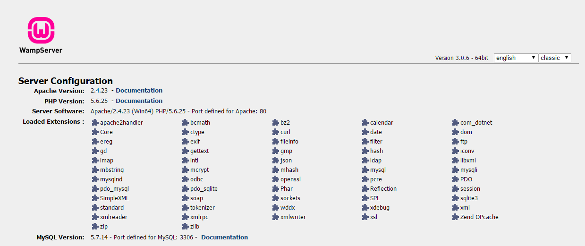
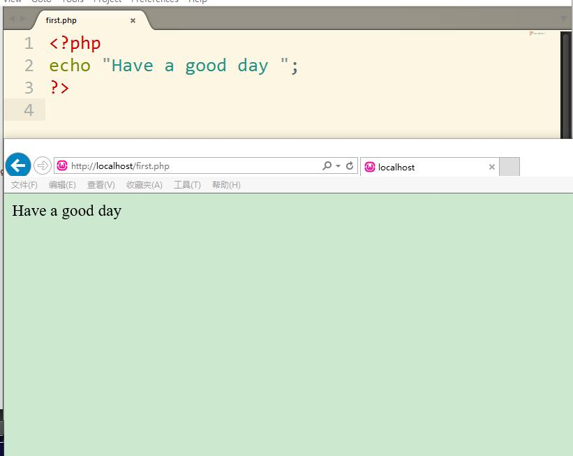

#任务23-熟悉后端语言

####动手

1.初学者在本地安装 Apache 与 PHP。安装 xampp 套件即可。XAMPP 里面包含 Apache 和 PHP.windows 用户也可安装 WAMP，安装包体积会小一些。对于后端熟悉的同学可单独安装Apache 和 PHP。

2.学习 xampp或者wamp 的简单配置使用，在本地启动 web 服务器，通过浏览器访问，通过浏览器打开本地 webserver 下的 php 文件，截图展示。

#### 问题

**1.简单描述下web 服务器、PHP、数据库、浏览器是如何实现动态网站的?**

(1)用户端访问服务器端的html文件：

* 根据用户输入的域名解析为对应IP地址。
* 尝试连接对应IP地址，发送打包请求html文件。
* web服务器端接受请求后找到对应html文件，并返回文件内容。
* 浏览器接受服务器返回html文件内容并解析渲染呈现在浏览器窗口。

(2)用户访问服务器端的php文件：
* 根据用户输入的域名解析为对应ip地址。
* 尝试连接对应IP地址，发送打包请求php文件。
* web服务器端委托php应用服务器处理接受打包请求的php文件。
* php应用服务器解析后翻译成html文件返回给web服务器，由web服务器将翻译后的html文件返回给客户端浏览器。
* 浏览器接受服务器返回html文件内容并解析渲染呈现在浏览器窗口。

(3)用户端访问服务器端的数据库：
* 根据用户输入的域名解析为对应ip地址。
* 尝试连接对应IP地址，发送打包请求php文件。
* 由web服务器委托php应用服务器处理接受的打包请求。
* 在php中通过对数据库的连接代码来连接对应数据库，并且由php程序执行标准SQL查询语句获取数据返回给php应用服务器，php应用服务器解析后翻译成html文件返回给web服务器，由web服务器将翻译后的html文件返回给客户端浏览器。
* 浏览器接受服务器返回html文件内容并解析渲染呈现在浏览器窗口。

**2.常见的 WEB 服务器有哪些？**

* Apache

Apache是世界使用排名第一的Web服务器软件。它几乎可以运行在所有的计算机平台上。由于Apache是开源免费的，因此有很多人参与到新功能的开发设计，不断对其进行完善。Apache的特点是简单、速度快、性能稳定，并可做代理服务器来使用。
* Nginx

Nginx不仅是一个小巧且高效的HTTP服务器，也可以做一个高效的负载均衡反向代理，通过它接受用户的请求并分发到多个Mongrel进程可以极大提高Rails应用的并发能力。
* IIS

IIS（Internet信息服务）英文InternetInformationServer的缩写。它是微软公司主推的服务器。IIS的特点具有：安全性，强大，灵活。

* Lighttpd

Lighttpd是由德国人JanKneschke领导开发的，基于BSD许可的开源WEB服务器软件，其根本的目的是提供一个专门针对高性能网站，安全、快速、兼容性好并且灵活的webserver环境。具有非常低的内存开销，CPU占用率低，效能好，以及丰富的模块等特点。支持FastCGI,CGI,Auth,输出压缩(outputcompress),URL重写,Alias等重要功能。

* Tomcat

Tomcat是Apache软件基金会（ApacheSoftwareFoundation）的Jakarta项目中的一个核心项目，由Apache、Sun和其他一些公司及个人共同开发而成。Tomcat技术先进、性能稳定，而且免费，因而深受Java爱好者的喜爱并得到了部分软件开发商的认可，成为目前比较流行的Web应用服务器。

* Zeus

Zeus是一个运行于Unix下的非常优秀的Web服务器，据说性能超过Apache，是效率最高的Web服务器之一。

**3.打开浏览器，在地址栏输入 http://jirengu.com 页面展现了饥人谷官网的信息，整个过程发生了什么？（饥人谷官网后台语言 php,web服务器 nginx，数据库 mysql）**

(1) 输入http:jirengu.com

(2)解析域名查询IP地址：121.40.201.213

* 查找浏览器缓存。
* 查找系统缓存。
* 查找路由器缓存。
* 查找ISP服务商提供的DNS缓存。
* 查找顶级域名根服务器开始递归查询。

(3)浏览器打包发送请求报文，通过TCP/IP协议建立连接，服务器接收请求，如果是html请求则找到对应html文件返回给浏览器，如果是php请求则委托php应用服务器处理并生成html返回给web服务器再返回给浏览器，如果有数据库请求则委托php应用服务器通过php连接对应数据库，通过php执行查询语句获取数据，再由php应用服务器生成html返回给web服务器再返回给浏览器。 

(4)浏览器根据接收且下载html文档，解析后呈现给用户。
